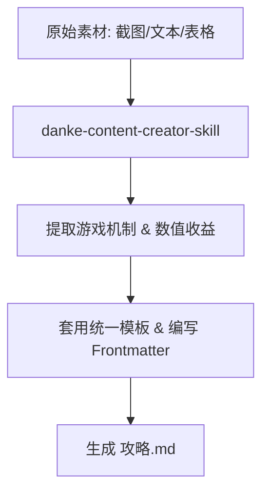

> [!NOTE]
> 📢 **Repository Migrated**: This skill has been migrated into the unified monorepo repository: [huabingtao/skills](https://github.com/huabingtao/skills).
> For the latest updates, issues, and documentation, please visit [huabingtao/skills](https://github.com/huabingtao/skills).

# danke-content-creator-skill

> **职责**：分析弹壳特攻队原始素材（截图/文本/数据），按标准模板生成初稿 `攻略.md`。

## 工作流程

## 与其他 Skill 的协作

1. **`danke-content-creator-skill`** (本 Skill)：素材 → 初稿 `攻略.md`
2. **`danke-strategy-skill`**：`攻略.md` → 微信公众号美化 HTML + 元数据 `_wechat.json`
3. **`article-to-img-skill`**：HTML → 3:4 切图集 (`原生网页直切图_3x4/`)
4. **`wechat-publisher-skill`**：HTML → 微信公众号草稿箱
5. **`douyin-publisher-skill`**：切图集 + 元数据 → 抖音草稿箱
